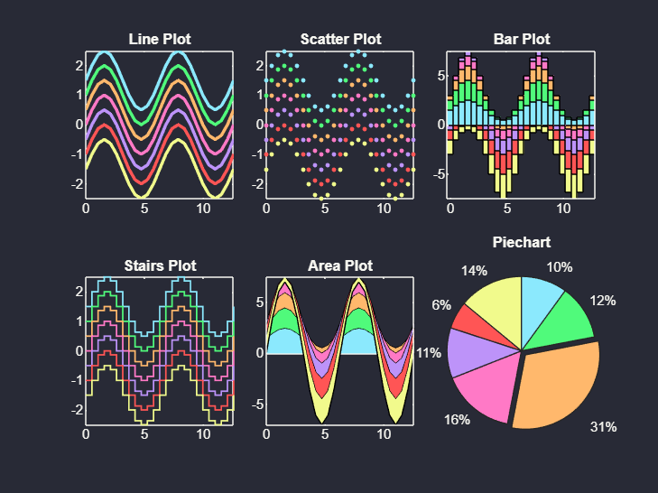

# Dracula
[](https://www.mathworks.com/matlabcentral/fileexchange/157951)

### Apply the popular `Dracula` color theme to figures in MATLAB


For additional information on the open-source `Dracula` theme, visit [https://draculatheme.com/](https://draculatheme.com/).

### Installation
Installation instructions can be found [here](https://github.com/weber1158/dracula/docs/INSTALLATION.md).

### How to use
* **Option 1:** See the detailed tutorial in the [`docs`](https://github.com/weber1158/dracula/docs/TUTORIAL.md) folder.

* **Option 2:** Open the `dracula_tutorial.mlx` file in your MATLAB Desktop application or in MATLAB Online.


### Documentation
Function documentation is available in the [`docs`](https://github.com/weber1158/dracula/docs/DOCUMENTATION.md) folder, but there is also documentation hardcoded into each function file. 

You can view function documentation with MATLAB's built-in `help` command. For example, to print the documentation for the `draculize` function, execute the following from the command window:

```matlab
help draculize
```

Substitute the `help` command with `doc` and the documentation for the function will open in a separate window.