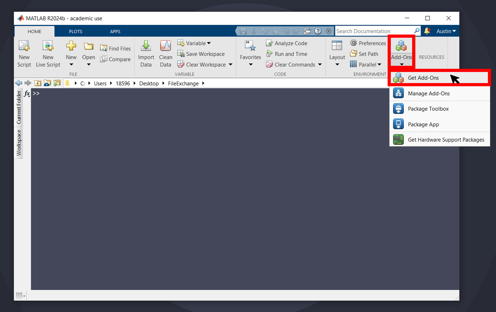

# **Dracula Installation**

## Step 1

Open MATLAB and click "Get Add-Ons".

## Step 2

Search for "dracula" and select "Dracula theme for figures".

## Step 3

Click "Add to MATLAB".

---
## Alternative Installation Instructions

### Option 1
 Download this GitHub repository and call the `pathtool` function from the MATLAB command window to save everything in the folder to the search path.

### Option 2
Go to the project on the  and open the repository directly in MATLAB Online. Use the `pathtool` function to add the files to the default search path.